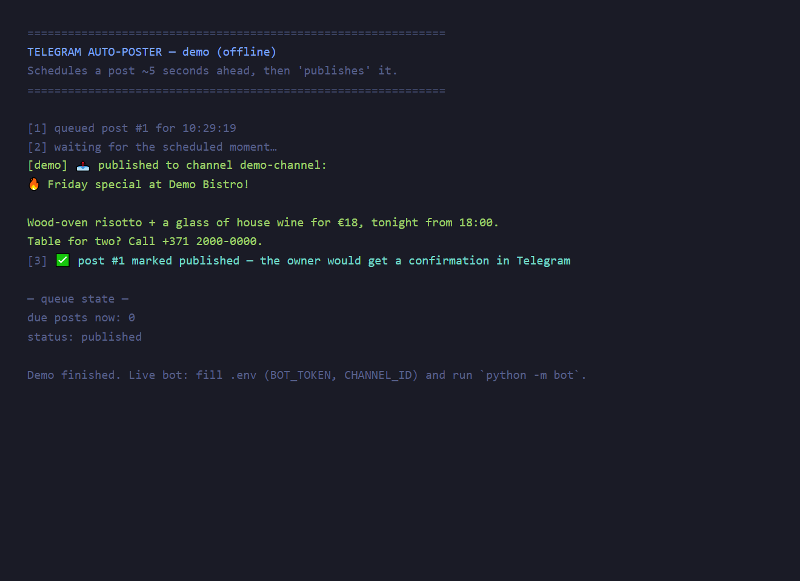

# Telegram Auto-Poster — scheduled content for business channels

A Telegram bot that publishes scheduled posts to a business channel: the owner sends text, picks a time (quick options or custom HH:MM), and the post goes out automatically — with retries on failure and a confirmation message. Includes an offline demo mode.

**Stack:** Python 3 · aiogram 3 (async) · SQLite · asyncio scheduler

---

## Business problem

Restaurants, clinics and salons run Telegram channels for menus, promos and announcements — but posting happens only when someone remembers. The Monday menu goes out on Tuesday, the weekend promo never does. Posting tools that do this are SaaS subscriptions; the underlying job is small enough to own.

## Solution

- The owner sends the post text to the bot → picks **In 1 hour / Tonight 18:00 / Tomorrow 09:00 / custom HH:MM** → done.
- The scheduler loop publishes due posts to the channel every 20 seconds and sends the owner a confirmation.
- A failed publish (network hiccup, API timeout) is retried automatically — up to 3 attempts with error logging — before being marked failed in the queue.
- `/queue` shows what's scheduled; `/cancel 12` unschedules a post.

## Key features

- Quick time options that never resolve into the past (23:50 + "tonight 18:00" → tomorrow 18:00)
- Async publish loop with retry + attempts/error tracking in SQLite
- Per-owner queue: only your posts are visible and cancellable
- **Offline demo**: schedules a post 5 seconds ahead and publishes it to the console — zero setup
- 6 unit tests: time resolution edge cases, due-post selection, retry-then-fail lifecycle

## Tech stack

| Layer     | Choice                 | Why                                          |
| --------- | ---------------------- | -------------------------------------------- |
| Bot       | aiogram 3 (async)      | FSM conversation + async scheduler in one loop |
| Scheduling| Own asyncio loop       | 60 lines, visible, no celery/redis for this scale |
| Storage   | SQLite (stdlib)        | Queue survives restarts, zero ops            |

## How it works

```
owner → bot: "Friday special…"          scheduler loop (every 20s)
       → pick time                          │ SELECT posts WHERE queued AND publish_at <= now
       → queued in SQLite ◀─────────────────┤ for each: send to CHANNEL_ID
                                            │ ok → published + owner confirmation
                                            └ fail → attempts++ → retry (3×) → failed
/queue → upcoming posts   /cancel N → unschedule
```

## Demo (no setup)

```bash
pip install -r requirements.txt
python demo/run_demo.py
```

## Screenshots



*(terminal transcript of the demo above)*

## For a real business

- **Restaurant / café** — the weekly menu and daily special go out on time, every time; staff writes the post once.
- **Clinic / salon** — health tips and schedule changes are scheduled a week ahead in one sitting.
- **Local gym / education center** — course announcements and reminders without a human remembering to press "send".

Extensions I'd build for a client: photo/media posts, repeating schedules ("every Mon 09:00"), and a small web dashboard for drafting the week's content.

## Local setup (live bot)

```bash
git clone https://github.com/Tankecu/telegram-auto-poster
cd telegram-auto-poster
pip install -r requirements.txt

cp .env.example .env   # BOT_TOKEN from @BotFather, CHANNEL_ID of your channel
python -m bot
```

Tests: `python -m unittest discover -s tests`

> This repository replaces the original 2024 prototype (sync/async conflicts, unreachable scheduler) with a working async implementation.
